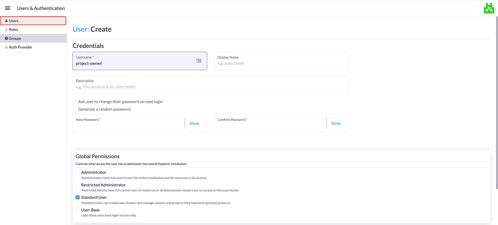
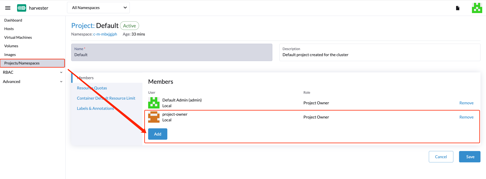
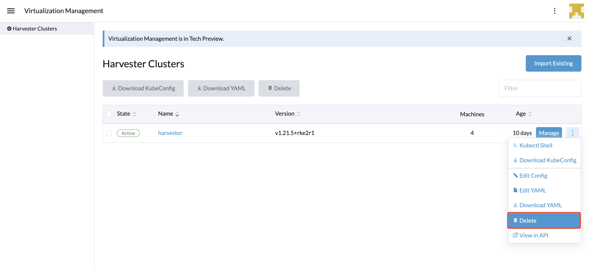

---
keywords:
  - Harvester
  - Rancher
---

## Virtualization Management

For Harvester v0.3.0 and above, virtualization management with the multi-cluster management feature will be supported using Rancher v2.6.x.

1. First, you will need to install Rancher v2.6.1 or above. For testing purposes, you can spin up a Rancher server using the following `docker run` command: 
    ```
    $ sudo docker run -d --restart=unless-stopped -p 80:80 -p 443:443 --privileged rancher/rancher:v2.6.2
    ```

    !!!note
        For a production environment setup, please refer to the official Rancher [docs](https://rancher.com/docs/rancher/v2.6/en/quick-start-guide/deployment/).

1. Once the Rancher server is up and running, log in and click the hamburger menu and choose the **Virtualization Management** tab. Select **Import Existing** to import the downstream Harvester cluster into the Rancher server.

1. Specify the `Cluster Name` and click **Create**. You will then see the registration guide; please open the dashboard of the target Harvester cluster and follow the guide accordingly.

1. Once the agent node is ready, you should be able to view and access the imported Harvester cluster from the Rancher server and manage your VMs accordingly.

1. From the Harvester UI, you can click the hamburger menu to navigate back to the Rancher multi-cluster management page.


## Multi-Tenancy

In Harvester, we have leveraged the existing Rancher [RBAC authorization](https://rancher.com/docs/rancher/v2.6/en/admin-settings/rbac/) such that users can view and manage a set of resources based on their cluster and project role permissions.

Within Rancher, each person authenticates as a user, which is a login that grants a user access to Rancher. As mentioned in [Authentication](https://rancher.com/docs/rancher/v2.6/en/admin-settings/authentication/), users can either be local or external.

Once the user logs into Rancher, their authorization, also known as access rights, is determined by global permissions and cluster and project roles.

- [**Global Permissions**](https://rancher.com/docs/rancher/v2.6/en/admin-settings/rbac/global-permissions/):
    - Define user authorization outside the scope of any particular cluster.
- [**Cluster and Project Roles**](https://rancher.com/docs/rancher/v2.6/en/admin-settings/rbac/cluster-project-roles/):
    - Define user authorization inside the specific cluster or project where users are assigned the role.

Both global permissions and cluster and project roles are implemented on top of [Kubernetes RBAC](https://kubernetes.io/docs/reference/access-authn-authz/rbac/). Therefore, enforcement of permissions and roles is performed by Kubernetes.

- A cluster owner has full control over the cluster and all resources inside it, e.g., hosts, VMs, volumes, images, networks, backups, and settings.
- A project user can be assigned to a specific project with permission to manage the resources inside the project.


### Multi-Tenancy Example
The following example provides a good explanation of how the multi-tenant feature works:

1. First, add new users via the Rancher `Users & Authentication` page. Then click `Create` to add two new separated users, such as `project-owner` and `project-readonly` respectively.
    - A `project-owner` is a user with permission to manage a list of resources of a particular project, e.g., the default project.
    - A `project-readonly` is a user with read-only permission of a particular project, e.g., the default project.
    
1. Click one of the imported Harvester clusters after navigating to the Harvester UI.
    - Click the `Projects/Namespaces` tab.
    - Select a project such as `default` and click the `Edit Config` menu to assign the users to this project with appropriate permissions. For example, the `project-owner` user will be assigned the project owner role.
   
1. Continue to add the `project-readonly` user to the same project with read-only permissions and click **Save**.
   
1. Open an incognito browser and log in as `project-owner`.
1. After logging in as the `project-owner` user, click the **Virtualization Management** tab. There you should be able to view the cluster to which you have been assigned.
1. Click the **Images** tab to view a list of images previously uploaded to the harvester-public namespace. You can also upload your own image if needed.
1. Create a VM with one of the images that you have uploaded.
1. Log in with another user, e.g., `project-readonly`, and this user will only have the read permission of this project.

!!!note
    A known issue was found that allows the [read-only user to be able to manage API actions](https://github.com/harvester/harvester/issues/1406).

## Delete Imported Harvester Cluster

Users can delete the imported Harvester cluster from the Rancher UI via **Virtualization Management > Harvester Clusters**. Select the cluster you want to remove and click the **Delete** button to delete the imported Harvester cluster.



!!! warning
    Please do not run the `kubectl delete -f ...` command to delete the imported Harvester cluster as it will remove the entire `cattle-system` namespace which is required of the Harvester cluster.
